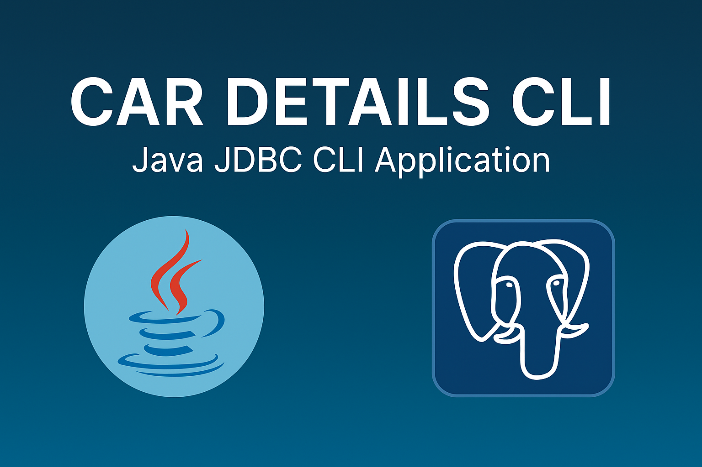
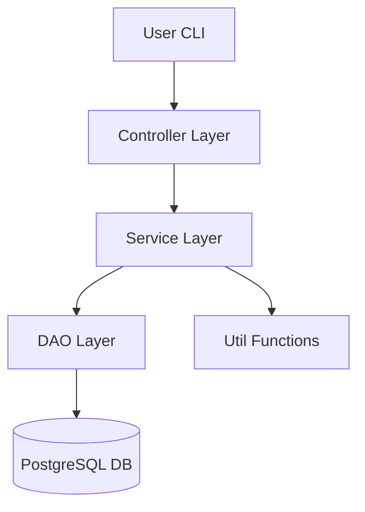
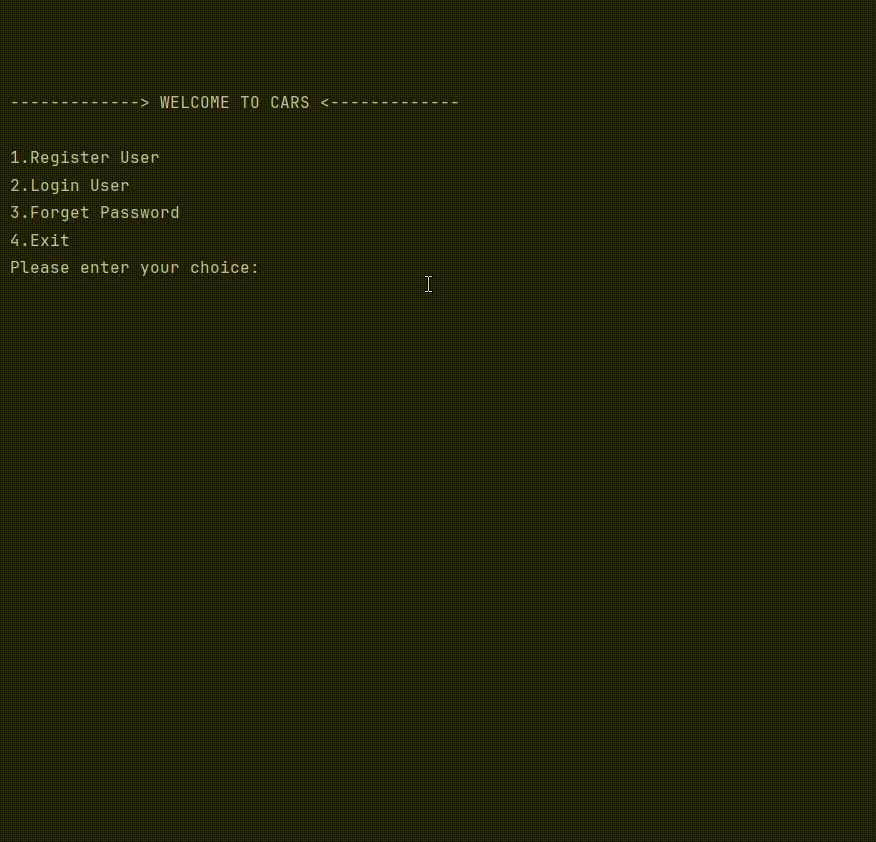
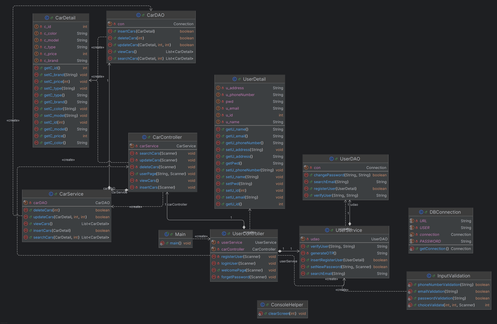
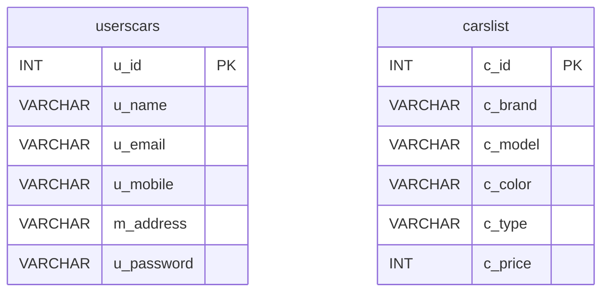

<p align="center">
  
</p>

# Cars CLI Application Documentation

## Badges


## Overview

This project is a simple Command-Line Interface (CLI) application for managing car details, user login, and basic operations. It is built using Java, JDBC, and PostgreSQL.

## Features

* User Registration
* User Login
* View Car Details
* OTP-based Password Reset
* Utility Functions for Console UI
* Clean DAO-Service-Controller Structure

## Technologies Used

* **Java 17+**
* **PostgreSQL**
* **JDBC**
* **Maven / IDE Build Tools**

## PostgreSQL JDBC Dependency

### ▶ For Maven users:

```xml
<dependency>
    <groupId>org.postgresql</groupId>
    <artifactId>postgresql</artifactId>
    <version>42.7.2</version>
</dependency>
```

### ▶ For Gradle users:

```gradle
dependencies {
    implementation 'org.postgresql:postgresql:42.7.2'
}
```

### ▶ For IntelliJ / Manual Setup:

Download the JDBC driver manually:

🔗 [https://jdbc.postgresql.org/download/](https://jdbc.postgresql.org/download/)

Add the `.jar` file to your project:

```
File → Project Structure → Modules → Dependencies → + Add JAR
```

## Architecture Diagram (Mermaid)



## Project Structure

```
src/main/java/
│
├── com.github.joel003
│   ├── dao/
│   │   └── UserDAO.java
│   ├── service/
│   │   └── UserService.java
│   ├── controller/
│   │   ├── CarController.java
│   │   └── UserController.java
│   ├── entity/
│   │   └── UserDetail.java
│   └── util/
│       ├── DBConnection.java
│       ├── ConsoleHelper.java
│       └── InputValidator.java
└── resources/
```

## Database Schema

Full SQL seed data provided here:

👉 [Download SQL Seed File](cars_seed_full.txt)

```
Table: userscars

u_id INT PRIMARY KEY
u_name VARCHAR(100)
u_email VARCHAR(100)
u_mobile VARCHAR(15)
m_address VARCHAR(100)
u_password VARCHAR(100)
```

## Example Car Table

A sample dataset of cars is included inside the project.

## How to Run

1. Make sure PostgreSQL is running.
2. Update DB credentials in `DBConnection.java`.
3. Compile and run the main class.

## How Login Works

* User enters email and password
* Application validates using `UserService.verifyUser()`
* On success, user navigates to user menu

## Password Reset Flow

* User enters registered email
* OTP is generated
* User must enter OTP within 10 seconds
* New password is accepted and updated

## Utility Classes

### DBConnection

Provides a single shared database connection.

### ConsoleHelper

Clears screen and formats CLI output.

### InputValidator

Reusable validation functions for email, phone, numbers, etc.

## Future Improvements

* Add Admin module
* Add Car Booking functionality
* Add JUnit Tests
* Add Logging with SLF4J
* Encrypt user passwords

## License

This project is licensed under the **MIT License**.

See the [LICENSE](LICENSE) file for full details.

## Additional Badges


## 🎬 Run Demo

Below is a short demo of the CLI in action:

<p align="center">
  
</p>

## 📸 CLI Screenshots

Click below to view all screenshots:

👉 [Open Screenshots Folder](Cars_Details_CLI-Screenshot/)

## UML Class Diagram

Below is the complete class diagram representing the system architecture.



## Database ER Diagram


